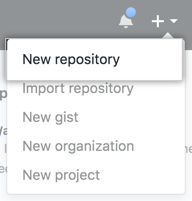
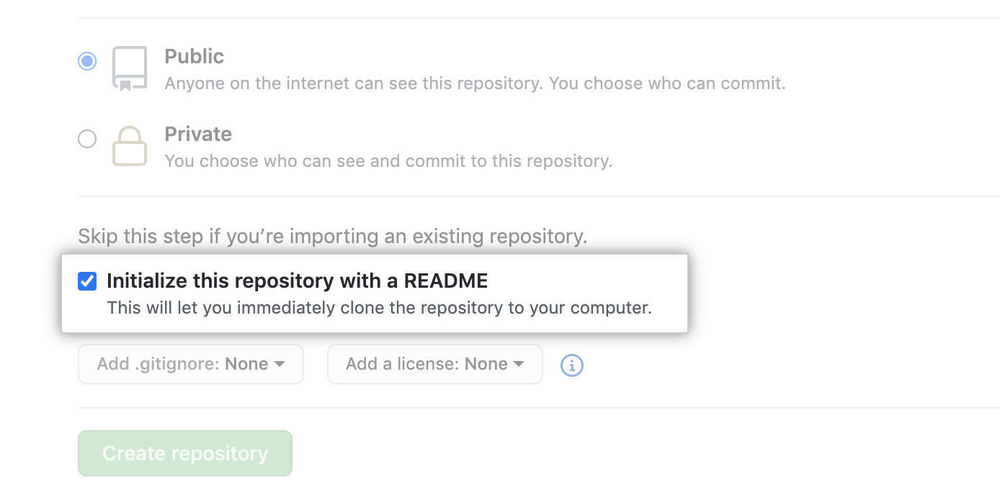
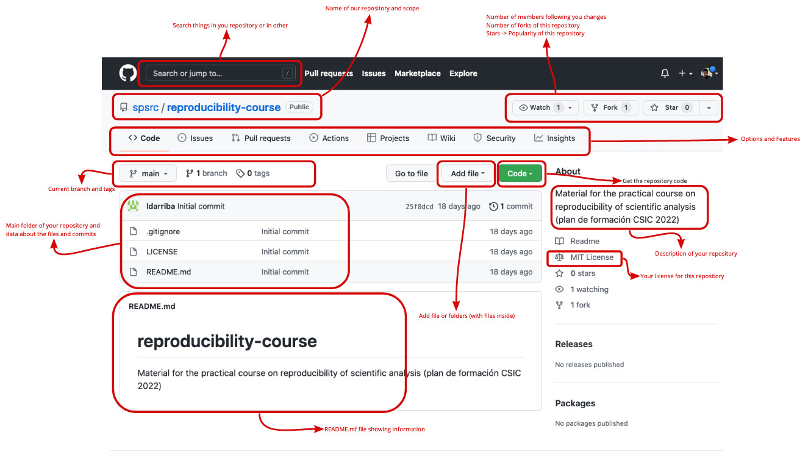
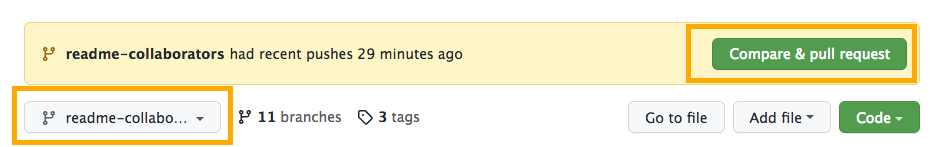
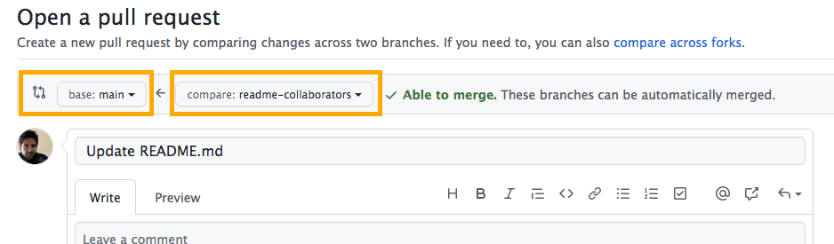
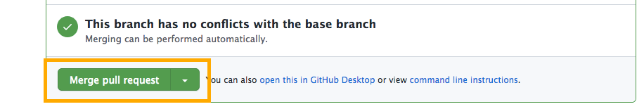
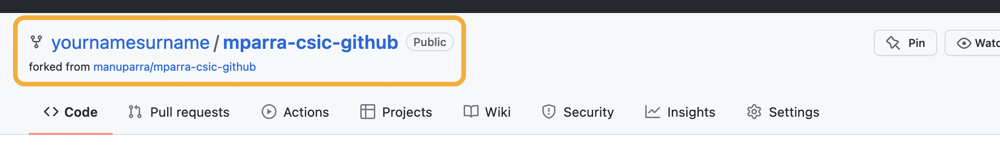
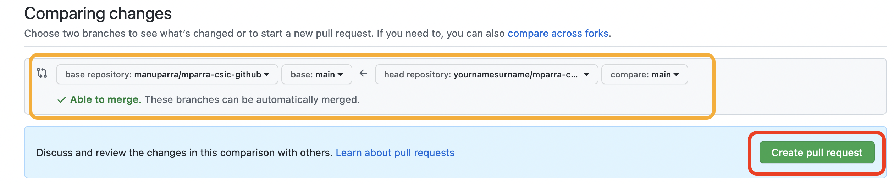
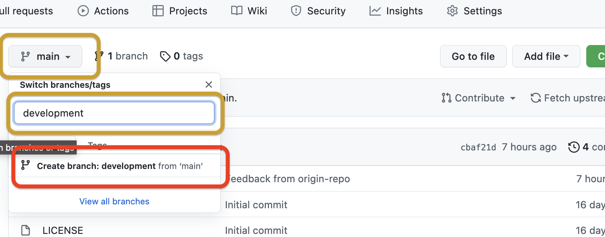
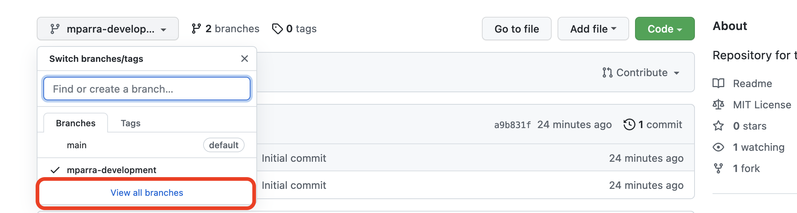

# Repository management and collaborative science platforms:  GitHub

*Objectives of this session:*

- To create a repository and include the basic information.
- To know in detail the version history of the repository.
- To manage and compare the versions of the files in the repository.
- To know what are fork and pull request on repositories.
- To manage different branches for a repository.
- To collaborate and to share with other members in a repository.
- To learn about other features to improve the work with repositories.

**Table of contents**
<HR>

<!-- vscode-markdown-toc -->
* 1. [Session content](#Sessioncontent)
	* 1.1. [Creating a new repository and configure the main options](#Creatinganewrepositoryandconfigurethemainoptions)
	* 1.2. [Adding content to our repository](#Addingcontenttoourrepository)
	* 1.3. [Working with the version history](#Workingwiththeversionhistory)
	* 1.4. [Forking a repository and creating a Pull Request](#ForkingarepositoryandcreatingaPullRequest)
	* 1.5. [Adding different branches to your repository](#Addingdifferentbranchestoyourrepository)
	* 1.6. [Collaborating with other users and reposositories](#Collaboratingwithotherusersandreposositories)
* 2. [Exercises](#Exercises)
	* 2.1. [Exercise 1 - Create an initial repository for this session](#Exercise1-Createaninitialrepositoryforthissession)
	* 2.2. [Exercise 2 -  Managing forks to collaborate](#Exercise2-Managingforkstocollaborate)
	* 2.3. [Exercise 3 - Managing branches](#Exercise3-Managingbranches)
	* 2.4. [Exercise 4 - Collaborating with other repositories and users - Homework](#Exercise4-Collaboratingwithotherrepositoriesandusers-Homework)

<!-- vscode-markdown-toc-config
	numbering=true
	autoSave=true
	/vscode-markdown-toc-config -->
<!-- /vscode-markdown-toc -->

<HR>

**Pre-requisites:**

You need to create or have a GitHub account:
- To create a GitHub account for the first time, follow the steps below.

:one: Go to your browser and open [GitHub](https://github.com/).
:two: Click top left on `Sign up`.

:three: Then select your GitHub `email`,  `password` and the `username`.

:four: Verify you account by solving a `"Puzzle"`.

:five: That's all. You have your new GitHub account.
:six: :rocket: You can now continue with the course.

<HR>


##  1. <a name='Sessioncontent'></a>Session content

###  1.1. <a name='Creatinganewrepositoryandconfigurethemainoptions'></a>Creating a new repository and configure the main options

GitHub is a code hosting platform for version control and collaboration. It lets you and others work together on projects from anywhere.

:warning: *To complete this session, [you need a GitHub account](http://github.com/) and Internet access. You don't need to know how to code, use the command line, or install Git (the version control software that GitHub is built on). If you have a question about any of the expressions used in this session, head on over to the **[glossary](https://docs.github.com/en/get-started/quickstart/github-glossary)** to find out more about our terminology.*

:fire: A repository is usually used to organize a single project. 

:exclamation: Repositories can contain folders and files, images, videos, spreadsheets, and data sets -- anything your project needs. Often, repositories include a `README` file, a file with information about your project. `README` files are written in the plain text [Markdown language](https://docs.github.com/en/get-started/writing-on-github/getting-started-with-writing-and-formatting-on-github/basic-writing-and-formatting-syntax). You can use this cheat sheet to get started with Markdown syntax. GitHub lets you add a `README` file at the same time you create your new repository. GitHub also offers other common options such as a *license file*.

We want to create a repository named `XXXX` where you can store ideas, resources, or even share and discuss things with others. To do that:

- :one: In the upper-right corner of any page, use the drop-down menu, and select **New repository**. 



- :two: In the Repository name box, enter XXXX. 


- :three: In the Description box, write a short description. 


- :four: Select Add a README file. Then we will change it. 



- :five: Select whether your repository will be Public or Private. In or case we will select Public. 


- :six: Click Create repository. 


 

That done, we now have our first repository ready to be used.

We will see the initial screen of our repository and we will explain each section of it:

 


###  1.2. <a name='Addingcontenttoourrepository'></a>Adding content to our repository

A `commit` is like a snapshot of all the files in your project at a particular point in time.

When we created your new repository, we initialized it with a `README.md` file. `README` files are a great place to describe your project in more detail, or add some documentation such as how to install or use your project. The contents of your `README`  file are automatically shown on the front page of your repository for each folder you have it.

Let's commit a change to the `README.md` file:

:one: In your repository's list of files, click `README.md`. 

 


:two: Above the file's content, click on the icon of a pencil (to edit).


:three: On the Edit file tab, type some information about your respository. 

 

For example, add the following text a

```
## Aim of this repository
This is my first repository to store information from my research on XXXX.

## How to collaborate:

- One: Clone this repository.
- Two: Add your features and collaborate with us on this research project.

## How to cite this repository

	@misc{YouName2022,
  		author = {Your Name},
  		title = {My first repository},
  		year = {2022},
  		publisher = {GitHub},
  		journal = {GitHub repository},
  		howpublished = {\url{URL_OF_THIS_REPO}}
		}

```


:four: Above the new content, click `Preview changes`. 

 


:five: At the bottom of the page, type a short, meaningful commit message that describes the change you made to the file. You can attribute the commit to more than one author in the commit message.

:six: Below the commit message fields, decide whether to add your commit to the current branch or to a new branch.

:seven: Commit the changes.

 


###  1.3. <a name='Workingwiththeversionhistory'></a>Working with the version history

Now it's time to make some more changes by adding a folder and inside that folder include a file with this content. Copy and paste the content into the file you want to edit and add it to the repository.

Add this new file in this path: `/funtions/plot.py`:

```
import matplotlib.pyplot as plt
fig = plt.figure()
ax = fig.add_axes([0,0,1,1])
langs = ['C', 'C++', 'Java', 'Python', 'PHP']
students = [23,17,35,29,12]
ax.bar(langs,students)
plt.show()
```

By doing this, we already have several changes fixed in the repository, so we can check the history of changes we have made. 

To do so, access the history from this option:

 

And we will see a list of changes we've made:

 

In this list we can review what changes we have made during the lifetime of the repository and compare the changes with respect to a certain date.

 

:one: Copy the ID of the commit.
:two: View and check differences and changes/deletions made in the repository and files.
:three: See the status of the repository at this point.


###  1.4. <a name='ForkingarepositoryandcreatingaPullRequest'></a>Forking a repository and creating a Pull Request

:bulb: A fork is a copy of a repository. Forking a repository allows you to freely experiment with changes without affecting the original project.

*Most commonly, forks are used to either propose changes to someone else's project or to use someone else's project as a starting point for your own idea.*

Two options with Fork:

- :construction_worker_woman: Propose changes to someone else's project. For example, you can use forks to propose changes related to fixing a bug or an improvement or new documentation, etc.
- :fireworks: Use someone else's project as a starting point for your own idea. Open source software is based on the idea that by sharing code, we can make better, more reliable software. 

:one: Go to our respository for the course: https://github.com/spsrc/reproducibility-course

:two: In the top-right corner of the page, click `Fork`. 

 

:three: Once this is done, we have a copy of the original repository in our account, so we can work with this copy and make all the changes we need. This way you work in the same way as with your own repository, but with the advantage that you already have a starting point from which you can work on a new idea or propose improvements to the original repository.

:bulb: *If we make some changes, for example to the README.md in this fork, we will see that a message appears indicating that our new "forked" repository is further ahead in "changes" (or commits) than the original, which means that we can either request a merge of our changes into the original via a Pull Request or compare both repositories.*


###  1.5. <a name='Addingdifferentbranchestoyourrepository'></a>Adding different branches to your repository

Branching lets you have different versions of a repository at one time.

By default, your repository has one branch named main that is considered to be the definitive branch. You can create additional branches off of main in your repository. You can use branches to have different versions of a project at one time. This is helpful when you want to add new features to a project without changing the main source of code. The work done on different branches will not show up on the main branch until you merge it, which we will cover later in this guide. You can use branches to experiment and make edits before committing them to main.

When you create a branch off the main branch, *you're making a copy*, or *snapshot*, of main as it was at that point in time. If someone else made changes to the main branch while you were working on your branch, you could pull in those updates.

 

This diagram shows:

- The main branch
- A new branch called feature
- The journey that feature takes before it's merged into main

Have you saved different versions of a file? Something like:

    story.txt
    story-edit.txt
    story-edit-reviewed.txt

Branches accomplish similar goals in GitHub repositories.

In GitHub, use branches for **keeping bug fixes** and **feature work** separate from our main (production) branch. When a change is ready, you can merge branches  into main.

**To create a new branch**

- :one: Click the Code tab of your XXXXX repository. 

 

- :two: Click the drop down at the top of the file list that says `Master` Branch menu.
- :three: Type a branch name, with the name `readme-collaborators`, into the text box to `create` a new branch.

 

- :four: Click Create branch: `readme-collaborators` from main.

Now you have two branches, `main` and `readme-collaborators`. Right now, they look exactly the same. 

We will now make changes to the Branch we have just made `readme-collaborators`. To do this, once selected, edit the `README.md` file and add the following text before the references section:


```
## Contributors

- Manuel Parra-Royón (use here you name)

```

Once the change has been made, we can merge the branch we just changed with the master branch so that we have those changes reflected.

To do this you can go to the main repository page and you will be prompted to merge these changes with the master branch by clicking "Compare and Pull Request"
	


Then you will see the screen to Check the merge and create a pull request.


	
After that you have to merge it
	

	
Now, your main branch is updated with the content of the `readme-collaborators`.

###  1.6. <a name='Collaboratingwithotherusersandreposositories'></a>Collaborating with other users and reposositories


Issues allow you to track your work on GitHub. When you mention an issue in another issue or pull request, the issue timeline reflects the cross-reference so you can track related work. To indicate that work is in progress, you can link an issue to a pull request. When the pull request is merged, the linked issue is automatically closed.

**Track work**

You can organize and prioritize issues with projects. To track issues as part of a larger issue, you can use task lists. To categorize related issues, you can use labels and milestones.

**Efficient communication**

You can @mention collaborators who have access to your repository in an issue to draw their attention to a comment. To link related issues in the same repository, you can type # followed by part of the issue title and then clicking the issue that you want to link. To communicate responsibility, you can assign issues.

**Opening a blank issue**

First, create an issue. There are multiple ways to create an issue; you can choose the most convenient method for your workflow. This example will use the GitHub UI. For more information about other ways to create an issue, see "Creating an issue."

:one: On GitHub, navigate to the main page of the repository.

:two: Under your repository name, click Issues. Issues tab

:three: Click New issue. 

:four: In this example, we will start with a blank issue. Your repository may use issue templates and issue forms to encourage contributors to provide specific information. If your repository uses issue templates, click Open a blank issue.
	
**Filling in information**

Give your issue a descriptive title. The title should convey at a glance what the issue is about.

Add a description that explains the purpose of the issue, including any details that might help resolve the issue. For example, if this is a bug report, describe the steps to reproduce the bug, the expected result, and the actual result.

You can use markdown to add formatting, links, emojis, and more. For more information, see [Markdown language](https://docs.github.com/en/get-started/writing-on-github/getting-started-with-writing-and-formatting-on-github/basic-writing-and-formatting-syntax).
	
**Adding a task list**

It can be helpful to break large issues into smaller tasks, or to track multiple related issues in a single larger issue. 
	
**Adding labels**

Add a label to categorize your issue. For example, you might use a bug label and a good first issue label to indicate that an issue is a bug that a first-time contributor could pick up. 	
	
**Adding milestones**

You can add a milestone to track the issue as part of a date based target. A milestone will show the progress of the issue.
	
**Assigning the issue**

To communicate responsibility, you can assign the issue to a member of your organization.	
	

##  2. <a name='Exercises'></a>Exercises

###  2.1. <a name='Exercise1-Createaninitialrepositoryforthissession'></a>Exercise 1 - Create an initial repository for this session

:pill: **Aim of this exercise**
In this exercise a new repository will be created and some modifications and data files will be added. Finally, the history of changes made will be reviewed.

<HR>

For this training exercise it will be necessary to create a new repository with the following initial details: 

:warning: Use the first letter of your first name and your first surname for the name of the repository + `-csic-github`. 
> :radioactive: :bulb: For example: If your name is `Manuel Parra`, your repository name will be:
> `mparra-csic-github`


- Repository name: ``<namesurname>-csic-github``.
- Repository description: ``Repository for the exercise 1``.
- Repository scope: ``Public``.
- Licence: For example select the ``MIT licence``.
- Add a default ``README.md``.

In the following image you can see the options to select for the creation of the repository:

 

Add some information to your repository by modyfing the `README.md` file. Use the following text to update the `README.md` file.

```
## Reproducibility course at CSIC with GitHub platform.

This is the working repository for the course exercises.
In this repository other students of the course will 
collaborate to complete the content.

# Session 1

## Creating a new repository and adding content

- [x] Created repository
- [x] Updated content

```
:arrow_right: Commit the change

After including this change, create a folder with the name `data` and add the following data file named `power.csv`, copying and pasting the following content:

```
date,max,avg,min
2021-10-05 15:00,5285.0,4126.0,3968.0
2021-10-05 15:15,5292.0,4125.0,3953.0
2021-10-05 15:30,5296.0,4125.0,3950.0
```

:arrow_right: Commit the change

Once this change is made, add a couple more lines of data to the `power.csv` file:

```
2021-10-05 15:45,5287.0,4123.0,3952.0
2021-10-05 16:00,5234.0,4122.0,3965.0
```

:arrow_right: Commit the change

:checkered_flag: :checkered_flag: After these steps, you can check the version history. 
> Could you go back to a previous version of the data table?


###  2.2. <a name='Exercise2-Managingforkstocollaborate'></a>Exercise 2 -  Managing forks to collaborate

:pill: **Aim of this exercise**
In this exercise we are going to use an existing repository to :fork_and_knife: *Fork* and interact with it, and finally propose some changes to be merged with the original existing repository by using a *Pull Request*. 
*The idea is to collaborate with an existing repository to propose some changes to the content.*

<HR>

To do this, we first go to this repository by clicking this link: 

https://github.com/manuparra/mparra-csic-github

Then, from the top right menu click the :fork_and_knife: *Fork* button and you will see a screen to select which organisation (of which you are a member) will do this operation, select one of them and in a few moments the repository will be a fork of the original one. If you are not a member of an organisation, it will directly :fork_and_knife: *Fork* the repository.

After that, you should see something like this, where the name of the repository is indicated and below it the original repository of the :fork_and_knife: *Fork*:

 

In this moment you are working with a :fork_and_knife: *Forked* copy of the original repository.
	
Now you have to make the following change:

- Use the `Add` option to include a `FOLDER` with your name and inside that folder a `README.md` file with the following text:


:warning: In order to create this `FOLDER`, use the first letter of your first name and your first surname. 
> :radioactive: :bulb: For example: If your name is `Manuel Parra`, your FOLDER and FILE path will be:
> `mparra/README.md`
> :warning: Use a path to create the file.

Paste the following text to the 

```
# Course of Reproduciblity @CSIC

In this course I will learn:
- Control version platforms like GitHub, containers and more!

```

:arrow_right: `Commit` the change and add a short description of this change with the following text: `Updated folder and README.md`

Now it is time to contribute the changes made by making a *Pull Request*, i.e. requesting the original repository that we *"would like"* to include these changes in the original repository. 

To do this go to the main repository screen and select the following option:

 


Doing this, it checks that there are no conflicts and you can propose the change by including a comment about the changes you want to push to the original repository. 



Include a title and a short description and then click `Create pull request`:


Once this is done, you will have to wait for the original repository owner to review the request and accept it. When this happens you will be notified in a short time :smile: .

###  2.3. <a name='Exercise3-Managingbranches'></a>Exercise 3 - Managing branches

:pill: **Aim of this exercise**
Branches allow you to develop features, fix bugs, or experiment with new ideas in a contained area of your repository isolated from the original repository.
*The idea is to create one branch, add content and update the original repository with the changes.*

<HR>

In this exercise, one branch will be created. Let's say that this new branch will include new features we want to implement or improve to the existing repository.

For this exercise you have to go to the repository *"Forked"* in the previous exercise. 

Once in the *Forked* repository we have to add a new branch.

To do this, create a new branch from the next option on the main screen of your repository and name it **"\<namesurname\>-development"**. 




You will see that when you select this icon, all the available branches will appear and you can switch between them to make changes in each one.


Now we are going to switch to the **"\<namesurname\>-development"** branch and to modify the `README.md` file, adding the following lines to the end of it:

```
# Session 1: Exercises 3 from <namesurname>
- Created a new branch for development.
```

:warning: In order to add this text, within the `<namesurname>` string, use the first letter of your first name and your first surname. 
> :radioactive: :bulb: For example: If your name is `Manuel Parra`, your text will be:
> ```
># Session 1: Exercises 3 from mparra
>Created a new branch for development.

Once this is done, we are going to merge the changes from the **"\<namesurname\>-development"** branch with the main branch. To do this, click on `view branches` and then on `view all branches`:



From here we can merge the changes made in the development branch with the main branch and original repository. Click on the `New pull request` button to do this. 

🏁 🏁 Soon your changes will be accepted by the repository owner.


###  2.4. <a name='Exercise4-Collaboratingwithotherrepositoriesandusers-Homework'></a>Exercise 4 - Collaborating with other repositories and users - Homework

:pill: **Aim of this exercise**
The aim of this exercise is for the student to be able to interact with the repository by collaborating with other users through the management of `Issues` and working with copies of repositories among the students.

<HR>

For this exercise you need to use the list of users and repositories listed in [this link](https://hackmd.io/z8JveJAvQTeiBsh0KnSg0Q?both#Homework---Exercise-4). On this page, find your name [here](https://hackmd.io/z8JveJAvQTeiBsh0KnSg0Q?both#Table-of-users-and-tasks-to-do-for-this-exercise), and the tasks you have to perform with each of these repositories.

The tasks to perform for this exercise are as follows:

- :one: Find your name in the list on this [link](https://hackmd.io/s/B1zp3lJm5).
- :two: Two tasks will appear, 
  - a) Make a fork of the repository listed below your name and then, 
  - b) Create at least two Issues on the second repository.


**For the first :one: repository** you have to make a fork of this repository and add a **directory** with your `namesurname` and a **file** inside named `plot.py` containing the following:

```
import matplotlib.pyplot as plt
plt.plot([1, 2, 3, 4])
plt.ylabel('some numbers')
plt.show()	
```
Once this is done you must `Create a Pull Request` with this change to the original repository.
	
**For the second :two: repository** you have to create at least one issue to the repository, to make one of the following changes, which the **repository owner** must do:
- a) Request to include a file with a science image.
- b) Request to include a data file.
- c) Request to add more information to README.md related to the aims.
- d) Report a typo for correction 

:bulb: *Use the @ to type the name of the repository owner for direct notification. For example: @manuparra*.
